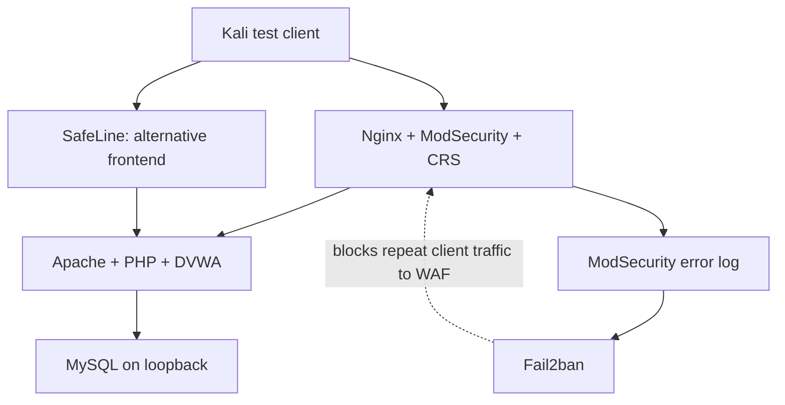

# WAF Hardening Lab

Learn how to deploy, inspect, tune, test, and roll back **SafeLine** and **Nginx + ModSecurity + OWASP CRS + Fail2ban** in front of **DVWA**.

This beginner-friendly repository offers a manual learning path and a scripted deployment path. The application runs on Ubuntu with Apache, PHP, and MySQL. Kali Linux is the test client. SafeLine and ModSecurity are alternative frontends: run one at a time.

**Scope:** an isolated training lab, not a production deployment of DVWA. DVWA is intentionally vulnerable. Keep it off the public Internet and use synthetic data.

## Start here

| Goal | Read / run |
|---|---|
| Understand the architecture | [Orientation](docs/00-orientation.md) |
| Download Ubuntu and Kali, create VMs | [Virtual machines](docs/01-virtual-machines.md) |
| Find every official download/container link | [Software inventory](docs/02-downloads.md) |
| Install everything manually | [Ubuntu + Docker](docs/03-ubuntu-docker.md), then [DVWA](docs/04-dvwa.md) |
| Understand backend isolation and certificates | [Network and TLS](docs/05-network-tls.md) |
| Deploy SafeLine | [SafeLine guide](docs/06-safeline.md) |
| Deploy ModSecurity + CRS | [ModSecurity guide](docs/07-modsecurity.md) |
| Blacklist / whitelist / tune a rule | [Custom rules](docs/08-custom-rules.md) |
| Limit request rates | [Rate limiting](docs/09-rate-limiting.md) |
| Ban repeated attackers | [Fail2ban](docs/10-fail2ban.md) |
| Verify the result | [Test exercises](docs/11-testing.md), [ZAP methodology](docs/12-zap.md) |
| Prepare a real application for production | [Hardening](docs/13-hardening.md) |
| Switch, restore, or migrate an existing lab | [Operations and rollback](docs/14-operations.md) |
| Fix common failures | [Troubleshooting](docs/15-troubleshooting.md) |
| Review what was actually observed | [Historical evidence](docs/16-results.md) |
| Publish your own repository | [GitHub workflow](docs/18-github.md) |

## Automatic path

First install **Ubuntu Server 24.04 LTS amd64** and **Kali Linux** in VMs. The scripts run inside an installed OS; they do not install an operating system onto an unbooted machine. Download helpers and VM instructions are included.

Extract this repository on a **fresh, dedicated Ubuntu VM**. Replace the example server address with the private IPv4 address assigned to your VM:

```bash
unzip waf-hardening-lab.zip
cd waf-hardening-lab
sudo bash scripts/setup.sh --server-ip 192.168.99.195 --mode modsecurity --yes
```

That command installs dependencies and Docker, creates the private backend network, clones a pinned DVWA revision, creates and initializes its database, configures Apache, generates a lab certificate, resolves Docker images to digests, starts the WAF and Fail2ban, and runs host smoke checks. It leaves authentication enabled and the DVWA security level at `impossible`; deliberately select `low` inside DVWA only when an exercise calls for it.

Run this on Kali after copying/extracting the repository there:

```bash
sudo bash scripts/kali-setup.sh 192.168.99.195
bash scripts/test-lab.sh 192.168.99.195 smoke
```

Open `https://dvwa.local/DVWA/login.php`. The self-signed certificate triggers a browser warning. DVWA's training login is `admin` / `password`.

For SafeLine, use a fresh lab with:

```bash
sudo bash scripts/setup.sh --server-ip 192.168.99.195 --mode safeline --yes
```

**SafeLine automation is guided, not unattended.** The same script prepares DVWA, invokes the official interactive installer, and asks you to create the protected site in the dashboard. It prints the exact domain, upstream, listeners, and certificate paths, then verifies the route. `--yes` skips this repository's initial confirmation only, not vendor prompts or dashboard onboarding. No undocumented provisioning API is invented.

To add SafeLine to a lab already created by this repository:

```bash
sudo bash scripts/safeline-setup.sh
```

## Deployment layout



Only one frontend owns ports 80/443 at a time. Apache listens on `127.0.0.1:8080` and `172.30.50.1:8080`, not the LAN interface. The ModSecurity container has `172.30.50.2`; its Fail2ban action matches only that destination and container ports `8080,8443`. SSH is outside that action.

## Useful commands

```bash
sudo bash scripts/labctl.sh status
sudo bash scripts/labctl.sh blacklist 192.168.99.141
sudo bash scripts/labctl.sh reset-rules
sudo bash scripts/labctl.sh whitelist 192.168.99.141
sudo bash scripts/labctl.sh reset-rules
sudo bash scripts/labctl.sh unban 192.168.99.141
sudo bash scripts/labctl.sh benchmark
sudo bash scripts/labctl.sh protection
sudo bash scripts/labctl.sh switch modsecurity
sudo bash scripts/labctl.sh switch safeline
```

The blacklist/whitelist helpers manage one exercise policy at a time and replace the previous exercise file after backing it up. A whitelist bypasses ModSecurity only; it does not undo a firewall ban or a request-rate limit.

## Versions and validation

- Installer target: fresh Ubuntu 24.04 LTS, amd64, rootful Docker with its iptables firewall backend. `iptables-nft` is supported; Docker's **native nftables backend** has a different architecture and is not supported by the supplied action.
- DVWA training baseline: tag `2.3`, commit `34a10d4166dcdc31f9641cf36ba5bd0fc1d4c59c`. This deliberate pin is separate from the original lab's unrecorded DVWA revision.
- ModSecurity and LinuxServer images are pulled once and stored as immutable digests in the private runtime `.env`. This makes a particular installation repeatable; it is not a claim that rolling tags are suitable production update policies.
- Runtime configuration, certificates, logs, and secrets live in `/opt/waf-hardening-lab`, outside the repository.
- See [VALIDATION.md](VALIDATION.md) for checks actually performed on this package. A complete two-VM deployment must still be exercised in your environment.

## Contents and provenance

All instructional content is in English. Configuration examples, shell scripts, a bounded test client, rollback procedures, an evidence worksheet, and GitHub CI checks are included. The original PDF and raw ZAP reports are not republished; the repository credits their source and includes only a sanitized numerical comparison. [References and attribution](docs/17-references.md).
